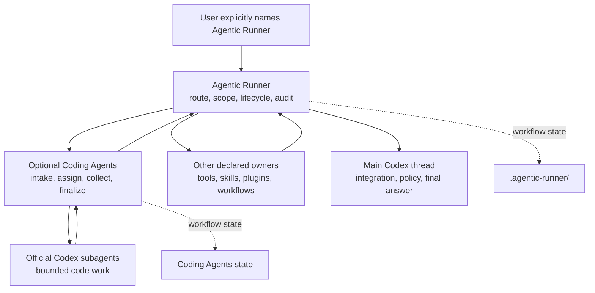

# Agentic Runner

Agentic Runner is an explicit-only upper control plane for Codex workflows, including one parent request that fans out into multiple artifacts. It records route, scope, lifecycle, supervision, handoff, and cross-workflow audit evidence while each declared execution owner remains responsible for its own artifact and verification.

Agentic Runner is fully usable on its own with tools, skills, plugins, and specialist workflows chosen for the job. [Coding Agents](https://github.com/mlabo-org/coding-agents) is an optional coding execution layer: when both are selected, the two form a verifiable pair, but neither plugin requires the other to be installed or invoked.

Both plugins are explicit-only and independently installable. Ordinary coding, debugging, delegation, or orchestration does not automatically route through them.

OpenAI Devpost category: **Developer Tools**

## Standalone Or Paired

- **Agentic Runner alone** — control one or many declared owners, including non-coding workflows, with shared constraints, supervision, resume checkpoints, and cross-output completion evidence.
- **Coding Agents alone** — take a coding task from specification consultation through bounded implementation and verification without an upper control plane.
- **Together** — use Agentic Runner for cross-workflow fan-out and convergence, and Coding Agents for the coding branch.

The shared marketplace is a distribution convenience, not a runtime coupling contract. Install either entry by itself or install both.

## Architecture



- Agentic Runner binds each supervised workflow to a `task_id`, `epoch`, declared scope, lifecycle, and completion evidence.
- When selected, Coding Agents preserves intake, assignment, collection, finalization, and handoff records while keeping its CLI record-only.
- Coding Agents worker dispatch uses the official Codex subagent surface. It never launches `codex exec` or a custom process runner.
- The main Codex thread retains policy, safety, integration, verification, and final-response ownership.
- Route, state, and contract checks fail closed when required evidence is missing or inconsistent.

## Upstream Control For Multi-Output Work

Agentic Runner controls the fan-out and convergence of a larger operation. It does not replace leaf generators. It turns one explicit parent request into an inspectable route map and keeps every declared execution owner accountable for its own artifact and verification evidence.

Coding Agents is not required. Agentic Runner can supervise any declared combination of tools, skills, plugins, or specialist workflows; Coding Agents is simply the purpose-built owner for a coding branch when that branch is present.

- Classify the parent route as `coding`, `article`, `video`, `plugin-source`, or `mixed`, then declare the primary and controlled workflows.
- Bind the whole operation to one `task_id`, `epoch`, scope, lifecycle contract, and shared completion conditions.
- Record multiple scoped assignments under that parent task, each with an explicit specialist owner and expected output. Independent work may run concurrently only when the parent determines that it is safe and the active execution surfaces support it.
- Keep handoff artifacts, resume checkpoints, stale-route handling, supervision state, and cross-workflow completion visible at the upper layer.
- Collect the artifact and verification evidence from every leaf owner. A blocked or failed branch remains explicit instead of allowing an incomplete batch to appear complete.
- Enforce Contract Coverage before final integration: accepted decisions, route/spec contracts, and completion conditions must map to concrete evidence.

For example:

> Use Agentic Runner explicitly to control a three-output release batch: source and tests through Coding Agents, release notes through a documentation owner, and a demo asset through a declared media owner. Keep shared constraints at the parent layer, assign an owner and acceptance evidence to every output, allow parallel work only where safe, and do not finalize until all three outputs pass their checks.

The leaf workflows still produce their domain artifacts. Agentic Runner supplies the upstream control needed to keep a multi-output generation batch coherent, resumable, auditable, and complete.

## Install One Or Both

Add this repository as a marketplace once:

```sh
codex plugin marketplace add mlabo-org/agentic-runner --ref main
```

Install Agentic Runner alone:

```sh
codex plugin add agentic-runner@agentic-control-plane
```

Install Coding Agents instead, or add it to form the pair:

```sh
codex plugin add coding-agents@agentic-control-plane
```

Restart Codex or start a new task after installation so the plugin surfaces you installed are loaded.

## Try It Alone Or Paired

For standalone upper control, use an explicit prompt such as:

> Use Agentic Runner explicitly to control a two-output release preparation. Route release notes to a documentation owner and a demo asset to a media owner. Keep shared constraints at the parent layer and do not finalize until both owners return their required evidence.

For the pair, open either repository in Codex and use an explicit prompt such as:

> Use Agentic Runner to supervise this repository audit. Route the bounded inspection to Coding Agents. Inspect README.md and package.json, run npm test, make no source changes or commits, and return the assignment state plus verification evidence.

The explicit names are intentional: neither plugin claims generic coding or orchestration requests.

## Run From Source

The repositories have no third-party runtime dependencies. A recent Node.js release and Git are required for source checks.

Validate Agentic Runner by itself:

```sh
git clone https://github.com/mlabo-org/agentic-runner.git
cd agentic-runner
npm test
npm run doctor:self
```

Validate Coding Agents separately when you want the optional coding layer:

```sh
git clone https://github.com/mlabo-org/coding-agents.git
cd coding-agents
npm test
npm run doctor:self
```

`doctor:self` validates the source-tree CLI. It does not claim that a separately installed plugin cache has been refreshed.

## Build Week Extension

The control-plane baseline existed before the 2026 OpenAI Build Week eligibility window. The submission asks judges to evaluate only these extensions made after the window opened:

- [Agentic Runner `a432c84`](https://github.com/mlabo-org/agentic-runner/commit/a432c84cb65689e7436cbfcd71184713757f7854) — lazy Git discovery, cached root resolution, batched runner-state appends, no-op rewrite avoidance, and a machine-checkable creator contract.
- [Coding Agents `a68c1b6`](https://github.com/mlabo-org/coding-agents/commit/a68c1b6585c79c11d0a5d89673659cd4d3c4c050) — removed the CLI-spawned Codex worker route and made official Codex subagents the only worker-dispatch path.
- [Coding Agents `678f9a9`](https://github.com/mlabo-org/coding-agents/commit/678f9a9224a562098f5909ee1037dd7677d79a96) — centralized scaffold contracts and reduced workflow-state overhead while preserving lifecycle and compatibility checks.

The current source suites contain 82 passing tests for Agentic Runner and 61 passing tests for Coding Agents.

## Platform And Boundaries

Verified on macOS 26.5.2 with Codex CLI 0.144.2, Node.js 24.18.0, and Git 2.55.0. The implementation uses Node.js standard-library APIs and Git, but other operating systems have not yet been verified.

Agentic Runner may write scoped workflow state under `<git-root>/.agentic-runner/`, update the target repository's `.git/info/exclude`, and create migration reports or preflight backups only when the corresponding command is explicitly invoked. It does not independently authorize source edits, commits, cache refresh, plugin activation, publishing, or broad repository cleanup.

The source repositories are authoritative. Installed copies under `~/.codex/plugins/cache/` are disposable runtime cache and must not be edited as source.

## Development Checks

```sh
npm test
npm run test:cli
npm run test:migration
npm run doctor:self
```

`scripts/migrate-legacy-agentic-runner-state.mjs` defaults to dry-run. Apply mode is explicit and creates preflight backups before changing a repository; it never deletes legacy directories.

## License

MIT License. Copyright (c) 2026 Makoto Suzuki.
